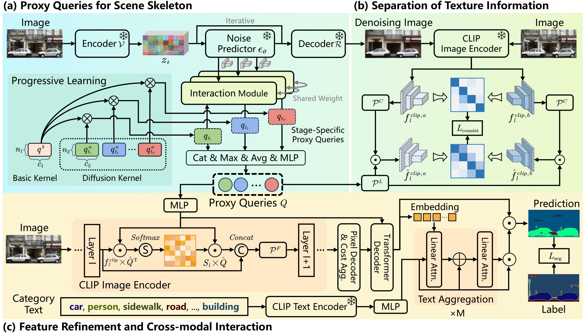

# Images as Noisy Labels: Unleashing the Potential of the Diffusion Model for Open-Vocabulary Semantic Segmentation

[](https://opensource.org/licenses/MIT) 
[](https://iccv.thecvf.com/virtual/2025/poster/645)
[

This repository is the official PyTorch implementation of the **ICCV 2025** (**Highlight**) paper:
[Images as Noisy Labels: Unleashing the Potential of the Diffusion Model for Open-Vocabulary Semantic Segmentation](https://openaccess.thecvf.com/content/ICCV2025/html/Li_Images_as_Noisy_Labels_Unleashing_the_Potential_of_the_Diffusion_ICCV_2025_paper.html),
authored by Fan Li, Xuanbin Wang, Xuan Wang, Zhaoxiang Zhang, and Yuelei Xu.

**Abstract:**
Recently, open-vocabulary semantic segmentation has garnered growing attention. Most current methods leverage vision-language models like CLIP to recognize unseen categories through their zero-shot capabilities. However, CLIP struggles to establish potential spatial dependencies among scene objects due to its holistic pre-training objective, causing sub-optimal results. In this paper, we propose a DEnoising learning framework based on the Diffusion model for Open-vocabulary semantic Segmentation, called DEDOS, which is aimed at constructing the scene skeleton. Motivation stems from the fact that diffusion models incorporate not only the visual appearance of objects but also embed rich scene spatial priors. Our core idea is to view images as labels embedded with "noise"--non-essential details for perceptual tasks--and to disentangle the intrinsic scene prior from the diffusion feature during the denoising process of the images. Specifically, to fully harness the scene prior knowledge of the diffusion model, we introduce learnable proxy queries during the denoising process. Meanwhile, we leverage the robustness of CLIP features to texture shifts as supervision, guiding proxy queries to focus on constructing the scene skeleton and avoiding interference from texture information in the diffusion feature space. Finally, we enhance spatial understanding within CLIP features using proxy queries, which also serve as an interface for multi-level interaction between text and visual modalities. Extensive experiments validate the effectiveness of our method, experimental results on five standard benchmarks have shown that DEDOS achieves state-of-the-art performance.



## Environment

- Python (3.8.19)
- PyTorch (1.13.1) 
- TorchVision (0.14.1)
- diffusers (0.30.2)

## Installation

```
conda create -n dedos python=3.8
conda activate dedos
conda install pytorch==1.13.1 torchvision==0.14.1 torchaudio==0.13.1 pytorch-cuda=11.7 -c pytorch -c nvidia
pip install -r requirements.txt
```

## Dataset Preparation

- Download COCO (2017) images from https://cocodataset.org/ and COCO-Stuff annotations from https://github.com/nightrome/cocostuff.
- Download the ADE20K-150 dataset from http://sceneparsing.csail.mit.edu.
- Download the data of ADE20k-Full from https://groups.csail.mit.edu/vision/datasets/ADE20K/request_data/.
- Download the data of PASCAL VOC from http://host.robots.ox.ac.uk/pascal/VOC/voc2012/#devkit.
- Download the PASCAL VOC 2010 data from [https://www.cs.stanford.edu/~roozbeh/pascal-context/](https://www.google.com/search?q=https://www.cs.stanford.edu/~roozbeh/pascal-context/) and the annotations for the [59](https://codalabuser.blob.core.windows.net/public/trainval_merged.json) and [459](https://roozbehm.info/pascal-context/trainval.tar.gz.) classes.

## Evaluation

    sh run.sh [CONFIG] [NUM_GPUS] [OUTPUT_DIR] [OPTS]
    
    sh eval.sh configs/vitl_336.yaml 4 output/ MODEL.WEIGHTS path/to/weights.pth

## Training

    sh run.sh [CONFIG] [NUM_GPUS] [OUTPUT_DIR] [OPTS]
    
    # For ViT-B variant
    sh run.sh configs/vitb_384.yaml 4 output/
    # For ViT-L variant
    sh run.sh configs/vitl_336.yaml 4 output/


## Acknowledgements

This repo is built upon these previous works:

- [CAT-Seg](https://github.com/cvlab-kaist/CAT-Seg)
- [Zegformer](https://github.com/dingjiansw101/ZegFormer)

## Citation

If you find it helpful, you can cite our paper in your work.

    @InProceedings{li2025images,
        author    = {Li, Fan and Wang, Xuanbin and Wang, Xuan and Zhang, Zhaoxiang and Xu, Yuelei},
        title     = {Images as Noisy Labels: Unleashing the Potential of the Diffusion Model for Open-Vocabulary Semantic Segmentation},
        booktitle = {Proceedings of the IEEE/CVF International Conference on Computer Vision (ICCV)},
        month     = {October},
        year      = {2025},
        pages     = {24255-24265}
    }
